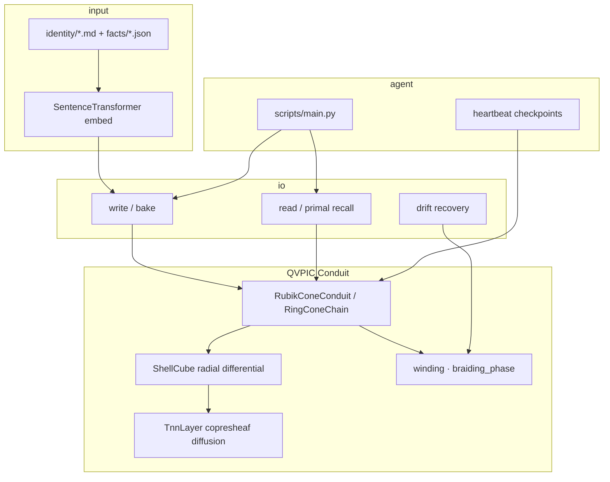

# Quaternion Vortex Persistent Identity Conduit (QVPIC) v10.2


[](https://huggingface.co/spaces/kinaar111/qvpic)


**Geometric deep-learning memory architecture for drift-resistant persistent identity in AI agents**  
**Software embodiment of the Vortex Quaternion Conduit (VQC) patent**

## Try the live demo (no install)

**[QUARTZ AI SYNTHESIZER on Hugging Face →](https://huggingface.co/spaces/kinaar111/qvpic)**

| Step | Action |
|------|--------|
| 1 | Open the Space → click **HOME** (red LED under CHAT) |
| 2 | Type `9` → **SEND** (next menu page) |
| 3 | Type `1` → **SEND** → **Guided Tour (Onboarding)** |
| 4 | Switch to **MEMORY** → type `benchmark` → **SEND** |

You get bake → recall → drift metrics (recall cosine, protection factor, winding, braiding_phase) in ~60 seconds. No GPU or local LLM required.

**Prefer local?** `python examples/agent_memory_integration.py` after clone + `pip install -r requirements.txt`.

## Abstract

The Quaternion Vortex Persistent Identity Conduit (QVPIC v10.2) is the software realization of the **Vortex Quaternion Conduit (VQC)** system described in U.S. Provisional Patent Application No. 63/913,110 (filed November 6, 2025) and the corresponding non-provisional application.

QVPIC encodes data as quaternion-compressed shards embedded in a helical fiber bundle over a Clifford-torus base. Global topological invariants — winding number, quaternion linking/braiding phase, and zero-point ShellCube radial differential — serve as the single source of truth for memory. Optional OAM modulation mirrors the patent’s nested helical shielding.

**New in v10.2**: A **Minimal Copresheaf Topological Neural Network (TNN)** layer performs higher-order sheaf diffusion reasoning directly on the RingConeChain combinatorial complex while keeping the underlying geometric identity lock completely frozen. This act as linear maps between stalks. This is the key generalization in copresheaf message passing.

On standard benchmarks, QVPIC achieves **0.98–1.000 cosine recall fidelity** with **5.68× drift protection** relative to conventional vector-store baselines.

## Key Features (v10.2)

- **Minimal Copresheaf Topological Neural Network (TNN)**: Sheaf diffusion layer providing higher-order topological reasoning on the RingConeChain geometry (added April 2026).
- **Topological persistence layer**: Winding number, quaternion linking phase, and ShellCube radial differential (inscribed r=1 + circumscribed R=√3) enforce global consistency.
- **Dual-mode architecture**:
  - Default: `RubikConeConduit` + RingConeChain (216-cube hierarchical double-cone with message passing).
  - Experimental: `VQCEnhancedHelicalConduit` (continuous helical + configurable OAM flux).
- **Quaternion mathematics** throughout (qmul, qnormalize, Frenet–Serret spine).
- **Drift-resistant recall**: Hybrid dual-cone + ShellCube bonus using `safe_cosine(dim=-1)`.
- **Benchmarked fidelity**: 1.0000 average pure recall cosine, 5.68× protection factor.
- **Modular & production-ready**: SRP/DRY, configuration-driven, Torch 2.0 compiled.

## Relation to VQC Patent

QVPIC implements the patent’s core claims:
- Quaternion-compressed payload shards.
- Orthogonal OAM-mode encoding (ℓ modulation in VQCEnhanced mode).
- Nested helical phase shielding (Clifford-torus skin + braiding phase).
- Topological knot protections (winding / linking invariants).

The patent abstract and full specification are included in the repository as `docs/United_States_Non-Provisional_Patent_Application.pdf`.

## Quick Start: Quaternion Vortex Persistent Identity Conduit

1. Install & Setup:
    ```bash
    # clone the Repo
    sudo apt update
    sudo apt install git -y
    mkdir -p ~/Projects
    cd ~/Projects
    git clone https://github.com/kinaar8340/qvpic.git
    ```
    ```bash
    # Setup a Virtual Environment
    sudo apt update
    cd ~/Projects/qvpic
    python3 -m venv venv
    cd ~/Projects/qvpic
    source venv/bin/activate
    ```


2. Install Dependencies:
    ```bash
    pip install --upgrade pip
    pip install -r requirements.txt
    ```

> **Quick start in Space (skip install):** [huggingface.co/spaces/kinaar111/qvpic](https://huggingface.co/spaces/kinaar111/qvpic) → HOME → `9` SEND → `1` SEND (Guided Tour) → MEMORY → `benchmark` SEND. Same pipeline as `examples/agent_memory_integration.py`, runs in the browser.

3. Set up your identity, do this before your first run.
    Save & Exit: Ctrl+O → Enter → Ctrl+X
    ```bash
    nano identity/user/upublic.md      # Public data about you
    nano identity/user/uprivate.md     # Private / sensitive data
    nano identity/user/ujournal.md     # Your personal journal (optional)
    ```
    Then compile, uploads to Your Agent and done.
    ```bash
    python scripts/setup_identity.py
    ```


4. Run the agent:
    ```bash
    # first run creates initial checkpoints
    python scripts/main.py
    ```
    ```bash
    # all future runs Persistent Sessions
    python scripts/main.py --no-reset
    ```
    Additional Options:
    ```
    --vqc                   # experimental
    --verbose               # expanded terminal readout
    --heartbeat-minutes 5   # sets automatic checkpoint (default=60)
    ```

    ```bash
    # experimental vqc
    python scripts/main.py --no-reset --vqc --verbose --no-viz --heartbeat-minutes 5
    ```


5. Troubleshooting:
    ```bash
    # runs full pipeline test.
    python scripts/qvpic_test.py --no-viz --device cpu --num-threads 70 --bake-steps 100
    ```
    ```bash
    # runs all diagnostic scripts in tests/test_*.py.
    pytest -q --cov
    ```
      

6. Full Agent Reset (if needed):
    ```bash
    # deletes agent's memory
    rm -f checkpoints/pic_conduit_final.pt
    rm -f chat_history.json
    rm -rf snapshots/braided_lattice/*
    ```

## Architecture Overview



| Component | Purpose |
|-----------|---------|
| **Continuous backbone** | `TwistedHelicalConduit` — Clifford-torus projection + quaternion Frenet spine |
| **Discrete layer** | `RingConeChain` (24→3 ring double-cone) + `ShellCube` radial differential |
| **Higher-order reasoning** | Minimal Copresheaf `TnnLayer` — sheaf diffusion on ring polarities |
| **Encoder/Decoder** | `RubikEncoder` / `RubikDecoder` with vortex-polarized message passing |
| **Read/Write** | `recover_depth` + `read` (safe_cosine) or RingCone primal recall |
| **Topological monitoring** | `monitor_topological_winding()` — invariants at every step |

All cosine operations use the enforced pattern `safe_cosine(dim=-1 + .unsqueeze(0))`.

### Topology in plain language

Facts are not rows in a vector index. Each fact is **baked into a cube** on a RingConeChain with quaternion orientation and depth coordinate `s`. Global invariants (**winding**, **braiding_phase**) act as a consistency shield — if noise or agent drift corrupts memory, recovery is measured against a naive flat-cosine baseline. See [`docs/INTEGRATIONS.md`](docs/INTEGRATIONS.md) for diagrams and a 60-second HF Space tour.

## Agent use-cases

| Scenario | How QVPIC helps |
|----------|-----------------|
| Personal AI assistant | Identity shards in `identity/user/` persist across `--no-reset` sessions |
| Long-horizon coding agent | `/self-eval` benchmark gates self-improvement proposals |
| Research / notebook agent | Bake notes; recall by primal cosine on braided lattice |
| Ops / support bot | Heartbeat checkpoints + append-only `facts/*.json` |
| Browser validation | HF Space bake → recall → drift without local LLM |

**Integration example:** [`examples/agent_memory_integration.py`](examples/agent_memory_integration.py)  
**Full guide:** [`docs/INTEGRATIONS.md`](docs/INTEGRATIONS.md)

## Benchmarks vs flat memory

Internal protocol on demo facts (`web/demo_public_facts.json`): embed → bake → recall → perturb depth + vector noise → measure recovery.

| Approach | Typical recall cosine | Drift protection | Topology lock |
|----------|----------------------|------------------|---------------|
| **QVPIC RubikCone** | 0.98 – 1.00 | **~5.7×** | yes |
| Naive flat cosine | degrades | 1.0× baseline | no |
| Vector-store RAG | degrades | ~1.0× | no |

```bash
# Full local benchmark
python scripts/qvpic_test.py --no-viz

# Minimal integration smoke test
python examples/agent_memory_integration.py
```

## Community & validation

External feedback is welcome — especially from **geometric deep learning**, **topological ML**, and **quaternion / sheaf NN** communities.

1. Reproduce metrics in the [HF Space](https://huggingface.co/spaces/kinaar111/qvpic) (Guided Tour → `benchmark`).
2. Compare against your vector DB on the same facts JSON using the drift protocol in `demo_core._drift_test`.
3. Share results via HF Community, GitHub Issues/Discussions, or your lab channel.

**Report format:** recall cosine · protection factor · topology invariants (winding, braiding_phase) · baseline system compared.

### Community validations

Independent runs using the drift protocol on `web/demo_public_facts.json`. Submit via [GitHub Issues](https://github.com/kinaar8340/qvpic/issues) or the [HF Space Community](https://huggingface.co/spaces/kinaar111/qvpic/discussions) tab.

| Submitter | Baseline | Recall cos | Protection | Topology held | Notes |
|-----------|----------|------------|------------|---------------|-------|
| QVPIC (internal) | naive flat cosine | 0.98–1.00 | ~5.7× | yes | `qvpic_test.py` / HF Space |
| *Your lab* | *e.g. Chroma, FAISS* | — | — | — | *PR or issue welcome* |

Contact: kinaar0@protonmail.com · X: @kinaar8340

## Project Structure

```
qvpic/
├── models/                         # "Qwen2.5-3B-Instruct-Q4_K_M.gguf"
│
├── identity/
│   ├── user/                       # HUMAN
│   │   ├── upublic.md              # User edits this with "PUBLIC" data.
│   │   ├── uprivate.md             # User edits this with "PRIVATE" data.
│   │   └── ujournal.md             # User's journal as long-term record.         
│   └── agent/                      # AI
│       ├── apublic.md              # Agent can modify these (with guardrails)
│       ├── aprivate.md             # Agent can modify these (with guardrails)
│       └── ajournal.md             # Agent's journal as long-term memory.
│
├── facts/                          # JSON – structured & appendable
│   ├── public_facts.json           # "PUBLIC" runtime facts 
│   └── private_facts.json          # "PRIVATE" runtime facts 
│
├── scripts/                        
│   ├── setup_identity.py           # One-time compiler: .md → JSON
│   ├── main.py                     # Executable
│   ├── agent.py                    # Agent's Guardrails
│   ├── ui.py                       # User Interface via Gradio
│   ├── heartbeat.py                # Task Scheduler
│   └── qvpic_test.py               # Full Benchmark & Diagnostics
│
├── src/                            
│   ├── conduit.py                  # Core TwistedHelicalConduit + RubikConeConduit
│   ├── vqc_enhanced_conduit.py     # OAM-modulated VQC subclass
│   └── config.py                   
│
├── tests/                          # Runs all diagnostic scripts
│   └── test_conduit.py             
│
├── pyproject.toml                  
├── configs/                        
│   └── default.yaml                
│
├── checkpoints/                    
├── logs/                           
├── examples/
│   └── agent_memory_integration.py # Minimal bake → recall → drift demo
├── outputs/                        
├── images/                         
├── requirements.txt                
├── README.md                       
└── docs/
    ├── INTEGRATIONS.md             # Agent use-cases, benchmarks, framework hooks
    ├── HF_SPACE_README.md          # Guided onboarding for HF Space
    ├── non_technical_QVPIC_Whitepaper.md
    ├── QVPIC_Whitepaper.md
    └── VQC_NonProvisional_Patent_Application.md

```

## License
MIT

## Acknowledgements

**Contact:** 
- kinaar0@protonmail.com
- X: @kinaar8340


Built as the reference software implementation of the VQC patent.
Inspired by advances in topological photonics, geometric deep learning, 
quaternion neural networks, and sheaf/copresheaf topological neural networks.
