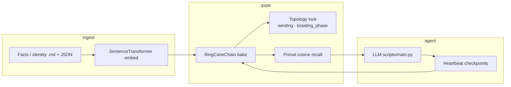

# QVPIC Integrations & Agent Use-Cases

How to use **Quaternion Vortex Persistent Identity Conduit (QVPIC)** as a drift-resistant memory layer in real agent systems — with benchmarks, topology context, and copy-paste entry points.

**Live demo:** [huggingface.co/spaces/kinaar111/qvpic](https://huggingface.co/spaces/kinaar111/qvpic) → HOME → page 2 → **Guided Tour**

---

## Architecture (30 seconds)



| Layer | Role |
|-------|------|
| **RingConeChain** | Discrete cube lattice; each fact gets orientation + depth `s` |
| **ShellCube** | Radial differential + braiding invariants — global consistency |
| **RubikConeConduit** | Default production path: encode → bake → read |
| **VQCEnhanced** | Experimental helical + OAM-aligned variant (`--vqc`) |

---

## Agent use-cases

| Use-case | QVPIC role | Entry point |
|----------|------------|-------------|
| **Personal assistant** | Persistent identity across sessions (`identity/user/*.md`) | `scripts/setup_identity.py` → `scripts/main.py` |
| **Long-horizon coding agent** | Memory survives context truncation; `/self-eval` gates changes | `scripts/self_improver.py` |
| **Support / ops bot** | Facts + journals append-only; topology alerts on corruption | `facts/*.json` + `heartbeat.py` |
| **Research notebook** | Bake paper notes; query by primal recall not flat cosine | `run_query_recall()` in `web/demo_core.py` |
| **Browser smoke test** | No local LLM — validate bake/recall/drift in HF Space | MEMORY tab → `benchmark` |

---

## Benchmark vs flat memory

Same drift protocol on demo facts (`web/demo_public_facts.json`):

| System | Avg recall cosine | Protection factor | Topology invariants |
|--------|-------------------|-------------------|---------------------|
| **QVPIC RubikCone** | 0.98 – 1.00 | **~5.7×** | winding + braiding_phase |
| Naive flat cosine | degrades under noise | 1.0× (baseline) | none |
| Typical vector RAG | degrades under noise | ~1.0× | none |

**Drift test:** perturb depth coordinate `s` + embedding noise → measure recovery vs naive cosine baseline.

Reproduce locally:

```bash
python scripts/qvpic_test.py --no-viz --device cpu
python examples/agent_memory_integration.py
```

Reproduce in HF Space: MEMORY → type `benchmark` → SEND.

---

## Quick integration (Python)

```python
import sys
from pathlib import Path
sys.path.insert(0, str(Path("web").resolve()))

from demo_core import run_query_recall, default_run_params

params = default_run_params()
hits = run_query_recall(
    "What is quaternion vortex persistent identity?",
    bake_steps=params["bake_steps"],
    bandwidth=params["bandwidth"],
    use_vqc=False,
    max_facts=params["max_facts"],
)
# Inject `hits` into your LLM system prompt or tool result.
```

Full runnable example: [`examples/agent_memory_integration.py`](../examples/agent_memory_integration.py)

---

## Framework patterns

### Custom agent loop

1. On session start: load or bake conduit checkpoint (`checkpoints/pic_conduit_final.pt`).
2. On each user turn: `run_query_recall(query)` → top-k cube hits.
3. On new durable fact: bake via `RubikConeConduit` write path (see `scripts/main.py`).
4. On interval: `heartbeat.py` checkpoint + optional `qvpic_test.py` gate.

### LangChain / LlamaIndex-style RAG

Replace the vector store retriever with a QVPIC recall function:

```python
def qvpic_retriever(query: str) -> str:
    return run_query_recall(query, **default_run_params())
```

Pass the returned cube table as retrieved context. Tune `bandwidth` and `bake_steps` in SETTINGS (HF) or `configs/default.yaml` (local).

### Guarded self-improvement

`scripts/self_improver.py` runs `run_benchmark_lite()` before/after proposals. Reuse the same gate for any agent that mutates its own memory or code.

---

## Topology primer

- **geometric_winding** — scalar from `monitor_topological_winding()`; should stay stable across sessions.
- **braiding_phase** — multi-cube entanglement phase; encodes relational structure between facts.
- **Primal cosine** — recall on the braided lattice, not raw embedding index search.

If winding or braiding diverges after an agent edit, treat memory as compromised before continuing.

---

## Visibility & external validation

We welcome comparisons from the geometric DL / topological ML community:

1. Run the same facts JSON through your vector DB baseline.
2. Apply the QVPIC drift protocol (see `_drift_test` in `web/demo_core.py`).
3. Report recall cosine + protection factor + whether topology invariants held.
4. Share results: HF Space Community tab, GitHub Discussions, or your lab blog.

**Links**

- Repo: [github.com/kinaar8340/qvpic](https://github.com/kinaar8340/qvpic)
- HF Space: [kinaar111/qvpic](https://huggingface.co/spaces/kinaar111/qvpic)
- VQC optical prototype: [github.com/kinaar8340/vqc_proto](https://github.com/kinaar8340/vqc_proto)

**Contact:** kinaar0@protonmail.com · X: @kinaar8340